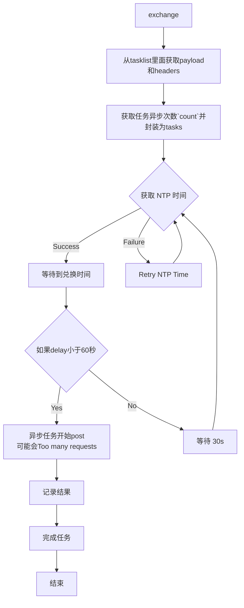

# 开发文档

### 兑换逻辑

### 兑换所需cookie：
| 字段名        | 说明   |
|--------------|--------|
| account id   | 必填   |
| cookie token | 必填   |
| ltoken       | 必填   |
| ltuid        | 必填   |
| login_ticket | 可选   |
| aliyungf_tc  | 可选   |

### 登陆方式
- 第一种手动登录，直接从用户输入的信息里面获取所需字段，代码在`app.py`和`tools.py`里面
- 第二种扫码登陆，接口参考：`https://github.com/UIGF-org/mihoyo-api-collect/blob/main/hoyolab/login/qrcode_hoyolab.md`

### 用户信息
保存在`flask_app/config.json`内，内容格式：
```json
{
    "cookies_list": {
        "ltoken": "",
        "ltuid": "",
        "account_id": "",
        "cookie_token": "",
        "account_mid_v2": ""
    },
    "device_id": ""
}
```